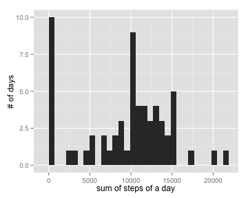
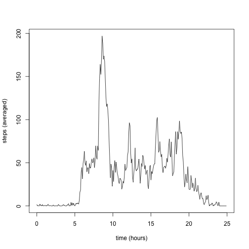
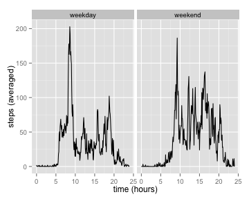

Introduction
============

It is now possible to collect a large amount of data about personal movement
using activity monitoring devices such as a Fitbit, Nike Fuelband, or Jawbone
Up. These type of devices are part of the "quantified self" "movement" a group
of enthusiasts who take measurements about themselves regularly to improve
their health, to find patterns in their behavior, or because they are tech geeks.

But these data remain under-utilized both because the raw data are hard to
obtain and there is a lack of statistical methods and software for processing and 
interpreting the data.

This assignment makes use of data from a personal activity monitoring device.
This device collects data at 5 minute intervals through out the day. The data
consists of two months of data from an anonymous individual collected during
the months of October and November, 2012 and include the number of steps
taken in 5 minute intervals each day.

## Data

The data for this assignment can be downloaded from the course web site:    

* Dataset: Activity monitoring data [52K]

The variables included in this dataset are:  

* steps: Number of steps taking in a 5-minute interval (missing values are
coded as NA)  
* date: The date on which the measurement was taken in YYYY-MM-DD format  
* interval: Identifier for the 5-minute interval in which measurement was taken  

The dataset is stored in a comma-separated-value (CSV) file and there are a
total of 17,568 observations in this dataset.

### Load libraries used during the analysis  
message here is hidden, since this is just to load the libraries, and I find
quite ugly to output the warning messages from i.e. dplyr.


```r
loadLibrary <- function(lib) { 
    if(!require(lib, character.only = T)) { 
        install.packages(lib)
        library(lib, character.only = T)
    } 
}

#loadLibrary("data.table")
#loadLibrary("reshape2")
loadLibrary("dplyr")
#loadLibrary("tidyr")
loadLibrary("tools")
loadLibrary("ggplot2")
loadLibrary("scales")
loadLibrary("knitr")
```


### Loading and preprocessing the data

Show any code that is needed to:  

1. Load the data


```r
data.file <- "./data/raw.data/activity.csv"
activity <- read.csv(file = data.file)
```

2. Process/transform the data (if necessary) into a format suitable for your
analysis


```r
# Change date from character to POSIXct format
activity$date = as.POSIXct(activity$date, format="%Y-%m-%d")


# add leading zeroes to interval so they fit to 4 digits
times <- formatC(activity$interval, width = 4, format = "d", flag = "0")

#Change interval variable to a "time" variable
activity$datetime = as.POSIXlt(paste(activity$date, times), 
                               format="%Y-%m-%d %H%M") 
# time in seconds (practical for converting & representing after wards) 
# represented in 'difftime' class
activity <- activity %>% 
    mutate(time = datetime - trunc(datetime, "days") ) 

activity <- select(activity, date, time, steps)
```

### What is mean total number of steps taken per day?

For this part of the assignment, you can ignore the missing values in the dataset.  

1. Make a histogram of the total number of steps taken each day


```r
steps.by.day <- activity %>% 
    group_by(date) %>%
    summarise(sum.steps = sum(steps, na.rm=TRUE), 
              avg.steps = mean(steps, na.rm = TRUE))

p <- ggplot(steps.by.day, aes(x = sum.steps))
p <- p + geom_histogram()
p <- p + ylab("# of days") + xlab("sum of steps of a day")
print(p)
```

 

2. Calculate and report the mean and median total number of steps taken
per day


```r
med.steps.day <- median(steps.by.day$sum.steps)
mean.steps.day <- mean(steps.by.day$sum.steps)

mean.steps.day.f <- formatC(mean.steps.day,digits = 2, format = "f")
med.steps.day.f <- formatC(med.steps.day, digits = 2, format ="f")
```

The __mean__ of steps taken per day is 9354.23, and the __median__ is 10395.00.

### What is the average daily activity pattern?  

1. Make a time series plot (i.e. type = "l") of the 5-minute interval (x-axis)
and the average number of steps taken, averaged across all days (y-axis)


```r
avg.across.days <- activity %>%
    group_by(time) %>%
    summarise(avg.steps = mean(steps, na.rm=TRUE))

plot(x = as.numeric(avg.across.days$time)/3600, y = avg.across.days$avg.steps,
     xlab = "time (hours)", ylab = "steps (averaged)",
     type = "l")
```

 

2. Which 5-minute interval, on average across all the days in the dataset,
contains the maximum number of steps?


```r
avg.across.days <- avg.across.days %>% mutate( ranking = min_rank(desc(avg.steps)))

max_steps <- avg.across.days %>% 
    filter(ranking == 1) %>% 
    mutate(time = format(.POSIXct(time, tz="GMT"), "%H:%M"))

avg.steps.f <- formatC(max_steps$avg.steps, digits = 1, format = "f") 
```
The __maximum number of steps in average__ (196.9) occurs at 08:35. 

### Imputing missing values
Note that there are a number of days/intervals where there are missing values
(coded as NA). The presence of missing days may introduce bias into some
calculations or summaries of the data.  

1. Calculate and report the total number of missing values in the dataset
(i.e. the total number of rows with NAs)  


```r
total.num.NAs <- length(which(is.na(activity$steps)))
```

The total number of missing values (counting only the variable _steps_) is 2304

2. Devise a strategy for filling in all of the missing values in the dataset. 
The strategy does not need to be sophisticated. For example, you could use the 
mean/median for that day, or the mean for that 5-minute interval, etc.  

There are multiple strategies to follow. In this case, I lean for using one that is already
integrated in the base R. Using the function _approxfun_, I impute missing values as a linear 
interpolation of the closest intervals to the missing values. If there are NAs at the extremes of
the list, a zero value is used (yleft = 0, yright = 0). Here I show an example on how NAs
are imputed. 

```r
wnas <- c(NA,1,3,7,NA,9,11,13,14,NA,15.5, NA, NA)
wnas_mvi <- approxfun(1:13, wnas,method = "linear", yleft = 0, yright = 0)(1:13)
```

A list of values with some NAs: NA, 1, 3, 7, NA, 9, 11, 13, 14, NA, 15.5, NA, NA  
is imputed as: 0, 1, 3, 7, 8, 9, 11, 13, 14, 14.75, 15.5, 0, 0  

3. Create a new dataset that is equal to the original dataset but with the
missing data filled in.  

```r
# "mvi" stands for "missing values imputed"
activity.mvi <- activity 
activity.mvi$steps <- as.numeric(approxfun(1:nrow(activity.mvi), activity.mvi$steps, 
                       method="linear", yleft = 0, yright = 0)(1:nrow(activity.mvi)))

total.num.NAs.mvi <- length(which(is.na(activity.mvi$steps)))
```

...and naturally now the number of NAs is 0.

4. Make a histogram of the total number of steps taken each day and calculate
and report the mean and median total number of steps taken per day. Do
these values differ from the estimates from the first part of the assignment?
What is the impact of imputing missing data on the estimates of the total
daily number of steps?  

```r
steps.by.day.mvi <- activity.mvi %>%
    group_by(date) %>%
    summarise(sum.steps = sum(steps), 
              avg.steps = mean(steps))

p <- ggplot(steps.by.day.mvi, aes(x = sum.steps))
p <- p + geom_histogram()
p <- p + ylab("# of days") + xlab("sum of steps of a day")
print(p)
```

 

```r
med.steps.day.mvi <- median(steps.by.day.mvi$sum.steps)
mean.steps.day.mvi <- mean(steps.by.day.mvi$sum.steps)

mean.steps.day.mvi.f <- formatC(mean.steps.day.mvi,digits = 2, format = "f")
med.steps.day.mvi.f <- formatC(med.steps.day.mvi, digits = 2, format ="f")
```

The mean without NAs is: 9354.23 (before it was 9354.23)  
The median without NAs is: 10395.00 (before it was 10395.00)  

__Extra__: Which days contain missing values? When there is missing values, do they always
affect to the whole day, or there is also some sparser missing values? 

```r
activity.NAs <- activity %>%
    filter(is.na(steps)) %>%
    group_by(date) %>%
    summarise(NApercentage = 100 * n_distinct(time) / (24 * 60 / 5) )

days.all.NAs <- nrow(activity.NAs %>% filter(NApercentage == 100) )
days.sparse.NAs <- nrow(activity.NAs %>% filter(NApercentage < 100) )

kable(activity.NAs, format = "html", align = "c") # kable is a better (nicer) way to display tables in knitr
```

<table>
 <thead>
  <tr>
   <th style="text-align:center;"> date </th>
   <th style="text-align:center;"> NApercentage </th>
  </tr>
 </thead>
<tbody>
  <tr>
   <td style="text-align:center;"> 2012-10-01 </td>
   <td style="text-align:center;"> 100 </td>
  </tr>
  <tr>
   <td style="text-align:center;"> 2012-10-08 </td>
   <td style="text-align:center;"> 100 </td>
  </tr>
  <tr>
   <td style="text-align:center;"> 2012-11-01 </td>
   <td style="text-align:center;"> 100 </td>
  </tr>
  <tr>
   <td style="text-align:center;"> 2012-11-04 </td>
   <td style="text-align:center;"> 100 </td>
  </tr>
  <tr>
   <td style="text-align:center;"> 2012-11-09 </td>
   <td style="text-align:center;"> 100 </td>
  </tr>
  <tr>
   <td style="text-align:center;"> 2012-11-10 </td>
   <td style="text-align:center;"> 100 </td>
  </tr>
  <tr>
   <td style="text-align:center;"> 2012-11-14 </td>
   <td style="text-align:center;"> 100 </td>
  </tr>
  <tr>
   <td style="text-align:center;"> 2012-11-30 </td>
   <td style="text-align:center;"> 100 </td>
  </tr>
</tbody>
</table>
  
There are 8 days, which contain only missing values (the whole day is missing). 
There are by the other hand 0 days containing sparse missing values. 

This explains why the mean and median values of the total steps taken by day does not change at all:
the data interpolation of missing values only affects to days, which data were completely missing. At
the imputation model I selected, these data will be imputed with a zero (since the closest values 
happen to be always zeroes). Actually, for these kind of data, it would have made more sense to me
to leave these missing values (of complete days). 

### Are there differences in activity patterns between weekdays and weekends?

For this part the weekdays() function may be of some help here. Use the dataset with the filled-in missing values for this part.  

1. Create a new factor variable in the dataset with two levels: "weekday" and "weekend"" indicating whether a given date is a weekday or weekend day. 

```r
activity.mvi <- activity.mvi %>% 
    mutate(weekday = as.factor(ifelse(weekdays(date) =="Saturday" | weekdays(date) == "Sunday",
                            yes = "weekend", no = "weekday")))
```

2. Make a panel plot containing a time series plot (i.e. type = "l") of the 5-minute interval (x-axis) and the average number of steps taken, averaged across all weekday days or weekend days (y-axis).

```r
avg.across.days.mvi <- activity.mvi %>%
    group_by(time, weekday) %>%
    summarise(avg.steps = mean(steps))

p <- ggplot(data = avg.across.days.mvi, aes(x = as.numeric(time)/3600, y = avg.steps)) 
p <- p + geom_line() + xlim(c(0,24)) 
p <- p + facet_wrap(facets =  ~ weekday )
p <- p + xlab("time (hours)") + ylab("steps (averaged)")
print(p)
```

 

